# 👋 Hello, I'm Patcharapon Chankhao

<div align="center">
  
</div>

<br>

<div align="center">
  
  
  
</div>

<br>

## 🚀 About Me

```typescript
interface dev_lead {
  name: string;
  role: string[];
  experience: Record<string, string>;
  current_focus: string[];
  leadership_style: string;
  technical_vision: string;
}

const patcharapon: dev_lead = {
  name: "Patcharapon Chankhao",
  role: ["Full Stack Developer", "Dev Lead", "DevOps Engineer"],
  experience: {
    "Node.js": "1+ years",
    "React.js & TypeScript": "1+ years", 
    "Python": "1+ years",
    "MongoDB": "1+ years",
    "DevOps": "1+ years"
  },
  current_focus: [
    "Team Leadership & Mentoring",
    "System Architecture Design", 
    "DevOps Culture Implementation",
    "Full Stack Development"
  ],
  leadership_style: "Collaborative, Technical, Growth-Oriented",
  technical_vision: "Scalable, maintainable, and efficient solutions"
};
```

<br>

## 🛠️ Tech Stack & Expertise

<div align="center">
  
</div>

<br>

### 🌟 Core Technologies
<div align="center">
  
</div>

<div align="center">
  
</div>

<br>

<div align="center">

| 💚 **Node.js** | ⚛️ **React** | 🔷 **TypeScript** | 🐍 **Python** |
|:---:|:---:|:---:|:---:|
|  |  |  |  |
| `Server-side Excellence` | `UI/UX Innovation` | `Type Safety First` | `AI & Automation` |

</div>

<br>

---

### 🎨 Frontend Development
<div align="center">
  
</div>

<div align="center">
  
</div>

<div align="center">


</div>

<br>

### ⚙️ Backend Development
<div align="center">
  
</div>

<div align="center">
  
</div>

<div align="center">


</div>

<br>

### 🗄️ Database Management
<div align="center">
  
</div>

<div align="center">
  
</div>

<div align="center">


</div>

<br>

### 🔧 DevOps & Tools
<div align="center">
  
</div>

<div align="center">
  
</div>

<div align="center">


</div>

<br>

### 📊 Skill Progression

```mermaid
graph LR
    A[🌱 Learning] --> B[📚 Intermediate]
    B --> C[⚡ Advanced] 
    C --> D[🚀 Expert]
    C --> E[👥 Teaching Others]
    
    subgraph "Current Focus"
        F[System Architecture]
        G[Team Leadership]
        H[DevOps Culture]
    end
    
    D --> F
    D --> G
    D --> H
```

<div align="center">
  
</div>



<br>

### 🎯 Tech Experience Timeline
<div align="center">

| Technology | Experience | Proficiency | Projects |
|:---:|:---:|:---:|:---:|
|  | `1+ years` | `🔥🔥🔥🔥⚪` | `15+ APIs` |
|  | `1+ years` | `🔥🔥🔥🔥⚪` | `20+ Apps` |
|  | `1+ years` | `🔥🔥🔥🔥⚪` | `10+ Projects` |
|  | `1+ years` | `🔥🔥🔥🔥⚪` | `8+ Scripts` |
|  | `1+ years` | `🔥🔥🔥🔥⚪` | `12+ DBs` |

</div>

<br>

### 🏆 Technical Achievements
<div align="center">
  
</div>

<div align="center">

```typescript
interface technical_achievements {
  apis_built: number;
  uptime_percentage: number;
  requests_per_minute: number;
  team_size: number;
  code_reviews: number;
  mentored_developers: number;
}

const achievements: technical_achievements = {
  apis_built: 15,
  uptime_percentage: 99.9,
  requests_per_minute: 10000,
  team_size: 5,
  code_reviews: 500,
  mentored_developers: 10
};

// 🎯 Always striving for excellence!
console.log("Building the future, one commit at a time! 🚀");
```

</div>

<br>

---

<div align="center">
  
</div>

## 📊 GitHub Statistics

<div align="center">
  
  
</div>

<br>

<div align="center">
  
</div>

<br>

## 🏆 Leadership & Technical Achievements

<div align="center">
  
</div>

<br>

## 📈 Contribution Activity

<div align="center">
  
</div>

<br>

## 🎯 Featured Projects & Architecture

<div align="center">
  <table>
    <tr>
      <td width="50%">
        <h3 align="center">🚀 Enterprise API Gateway</h3>
        <div align="center">
          <a href="https://github.com/your-username/api-gateway" target="_blank">
            
          </a>
          <br><br>
          <p>
            
            
            
          </p>
          <p><strong>Scalable microservices architecture</strong><br>99.9% uptime, handles 10k+ requests/min</p>
        </div>
      </td>
      <td width="50%">
        <h3 align="center">🌟 Real-time Collaboration Platform</h3>
        <div align="center">
          <a href="https://github.com/your-username/collab-platform" target="_blank">
            
          </a>
          <br><br>
          <p>
            
            
            
          </p>
          <p><strong>WebSocket-based real-time communication</strong><br>Improved team productivity by 40%</p>
        </div>
      </td>
    </tr>
  </table>
</div>

<br>

### 💻 Code Architecture Examples

```typescript
// Scalable microservices architecture
interface api_gateway {
  services: string[];
  load_balancer: string;
  authentication: string;
  rate_limiting: boolean;
  monitoring: string;
}

const architecture: api_gateway = {
  services: ["user-service", "payment-service", "notification-service"],
  load_balancer: "nginx",
  authentication: "JWT + OAuth2",
  rate_limiting: true,
  monitoring: "prometheus + grafana"
};
```

```python
# Real-time collaboration system
class collaboration_manager:
    def __init__(self):
        self.active_sessions: Dict[str, Session] = {}
        self.websocket_connections: List[WebSocket] = []
    
    async def broadcast_changes(self, room_id: str, data: dict) -> None:
        """Broadcast real-time changes to all connected clients"""
        for connection in self.get_room_connections(room_id):
            await connection.send_json(data)
```

<br>

## 👥 Leadership & Management Excellence

<div align="center">
  
  
  
</div>

<br>

```yaml
Leadership Philosophy:
  approach: "Technical Leadership with Human-Centered Management"
  core_values:
    - "Code Quality & Best Practices"
    - "Continuous Learning & Growth"
    - "Collaborative Decision Making"
    - "Innovation & Experimentation"
  
Team Development:
  mentoring: "Junior to Mid-level developers"
  code_reviews: "Architecture patterns & performance optimization"
  knowledge_sharing: "Weekly tech talks & pair programming"
  career_growth: "Individual development plans & skill mapping"
```

<br>

## 🎓 Professional Development & Expertise

<div align="center">
  
  
  
</div>

<br>

**Current Learning Journey:**
- 🏗️ **System Design Patterns** - Microservices, Event-Driven Architecture
- 🚀 **Cloud Architecture** - AWS, Serverless, Infrastructure as Code
- 📊 **Performance Engineering** - Load testing, optimization strategies
- 🎯 **Technical Leadership** - Engineering management, team scaling

<br>

## 📝 Knowledge Sharing & Community

<!-- BLOG-POST-LIST:START -->
- [🚀 Building Scalable Node.js Applications: A Dev Lead's Perspective](https://your-blog.com/scalable-nodejs)
- [⚡ DevOps Best Practices for Agile Teams](https://your-blog.com/devops-agile-teams)
- [🍃 MongoDB Performance Optimization in Production](https://your-blog.com/mongodb-optimization)
- [👥 Leading Remote Development Teams: Lessons Learned](https://your-blog.com/remote-team-leadership)
- [🔧 TypeScript Best Practices for Large-Scale Applications](https://your-blog.com/typescript-best-practices)
<!-- BLOG-POST-LIST:END -->

<br>

## 🤝 Let's Connect & Collaborate

<div align="center">
  <a href="https://your-portfolio.com">
    
  </a>
  <a href="https://linkedin.com/in/your-profile">
    
  </a>
  <a href="mailto:your-email@gmail.com">
    
  </a>
  <a href="https://github.com/PHATCHARAPHON63">
    
  </a>
</div>

<br>

---

<div align="center">
  <h3>💼 Open for Opportunities</h3>
  <p>
    
    
    
    
  </p>
</div>

---

<div align="center">
  
</div>

<br>

<div align="center">
  
**💡 "Great leaders don't create followers, they create more leaders."**  
*Building tomorrow's tech teams today.*


</div>
