# 👋 Hello, I'm Patcharapon Chankhao

<div align="center">
  
</div>

<br>

<div align="center">
  
  
  
</div>

<br>

## 🚀 About Me

```typescript
interface DeveloperProfile {
  name: string;
  role: string[];
  experience: Record<string, ExperienceLevel>;
  current_focus: string[];
  leadership_style: string;
  technical_vision: string;
  soft_skills: string[];
  achievements: Achievement[];
}

interface ExperienceLevel {
  years: string;
  proficiency: 'Beginner' | 'Intermediate' | 'Advanced' | 'Expert';
  projects: number;
  description: string;
}

interface Achievement {
  title: string;
  description: string;
  impact: string;
}

const patcharapon: DeveloperProfile = {
  name: "Patcharapon Chankhao",
  role: ["Full Stack Developer", "Dev Lead", "DevOps Engineer"],
  experience: {
    "Node.js": {
      years: "1+ years",
      proficiency: "Advanced",
      projects: 8,
      description: "Building scalable APIs and microservices"
    },
    "React.js & TypeScript": {
      years: "1+ years", 
      proficiency: "Advanced",
      projects: 12,
      description: "Creating responsive and maintainable UIs"
    },
    "Python": {
      years: "1+ years",
      proficiency: "Intermediate",
      projects: 5,
      description: "Automation scripts and data processing"
    },
    "MongoDB": {
      years: "2+ years",
      proficiency: "Advanced",
      projects: 10,
      description: "Database design and optimization"
    },
    "DevOps": {
      years: "1+ years",
      proficiency: "Intermediate",
      projects: 6,
      description: "CI/CD pipelines and infrastructure"
    }
  },
  current_focus: [
    "Team Leadership & Mentoring",
    "System Architecture Design", 
    "DevOps Culture Implementation",
    "Full Stack Development",
    "Performance Optimization"
  ],
  leadership_style: "Collaborative, Technical, Growth-Oriented",
  technical_vision: "Scalable, maintainable, and efficient solutions",
  soft_skills: [
    "Technical Communication",
    "Problem Solving",
    "Team Collaboration",
    "Code Review Excellence",
    "Project Planning"
  ],
  achievements: [
    {
      title: "Led 5-person development team",
      description: "Successfully managed and mentored junior developers",
      impact: "Improved team productivity by 30%"
    },
    {
      title: "Built 15+ production APIs",
      description: "Designed and implemented scalable backend services",
      impact: "99.9% uptime with 10k+ requests/minute handling"
    },
    {
      title: "Implemented DevOps practices",
      description: "Established CI/CD pipelines and monitoring",
      impact: "Reduced deployment time by 60%"
    }
  ]
};

// 🎯 Professional Development Goals
const careerGoals = {
  shortTerm: ["Master cloud architecture", "Improve system design skills"],
  longTerm: ["Become a technical architect", "Lead larger engineering teams"],
  continuous: ["Stay updated with latest technologies", "Contribute to open source"]
};
```

<br>

## 🛠️ Tech Stack & Expertise

<div align="center">
  
</div>

<br>

### 🌟 Core Technologies
<div align="center">
  
</div>

<div align="center">
  
</div>

<br>

<div align="center">

| 💚 **Node.js** | ⚛️ **React** | 🔷 **TypeScript** | 🐍 **Python** |
|:---:|:---:|:---:|:---:|
|  |  |  |  |
| `Advanced Level` | `Advanced Level` | `Advanced Level` | `Intermediate Level` |

</div>

<br>

---

### 🎨 Frontend Development
<div align="center">
  
</div>

<div align="center">
  
</div>

<div align="center">


</div>

<br>

### ⚙️ Backend Development
<div align="center">
  
</div>

<div align="center">
  
</div>

<div align="center">


</div>

<br>

### 🗄️ Database Management
<div align="center">
  
</div>

<div align="center">
  
</div>

<div align="center">


</div>

<br>

### 🔧 DevOps & Tools
<div align="center">
  
</div>

<div align="center">
  
</div>

<div align="center">


</div>

<br>

### 📊 Skill Progression

```mermaid
graph LR
    A[🌱 Learning] --> B[📚 Intermediate]
    B --> C[⚡ Advanced] 
    C --> D[🚀 Expert]
    C --> E[👥 Teaching Others]
    
    subgraph "Current Focus"
        F[System Architecture]
        G[Team Leadership]
        H[DevOps Culture]
        I[Performance Optimization]
    end
    
    D --> F
    D --> G
    D --> H
    C --> I
```

<div align="center">
  
</div>



<br>

### 🎯 Tech Experience Timeline
<div align="center">

| Technology | Experience | Proficiency | Projects |
|:---:|:---:|:---:|:---:|
|  | `1+ years` | `🔥🔥🔥🔥⚪` | `8+ APIs` |
|  | `1+ years` | `🔥🔥🔥🔥⚪` | `12+ Apps` |
|  | `1+ years` | `🔥🔥🔥🔥⚪` | `10+ Projects` |
|  | `1+ years` | `🔥🔥🔥⚪⚪` | `5+ Scripts` |
|  | `1+ years` | `🔥🔥🔥🔥⚪` | `10+ DBs` |

</div>
<br>

---

<div align="center">
  
</div>

## 📊 GitHub Statistics

<div align="center">
  
  
</div>

<br>

<div align="center">
  
</div>

<br>

## 🏆 Leadership & Technical Achievements

<div align="center">
  
</div>

<br>

## 📈 Contribution Activity

<div align="center">
  
</div>

<br>

## 🎯 Featured Projects & Architecture

<div align="center">
  <table>
    <tr>
      <td width="50%">
        <h3 align="center">🚀 E-commerce API Platform</h3>
        <div align="center">
          <a href="https://github.com/PHATCHARAPHON63/ecommerce-api" target="_blank">
            
          </a>
          <br><br>
          <p>
            
            
            
          </p>
          <p><strong>RESTful API with authentication & payment integration</strong><br>99.9% uptime, handles 5k+ requests/min</p>
        </div>
      </td>
      <td width="50%">
        <h3 align="center">🌟 Task Management App</h3>
        <div align="center">
          <a href="https://github.com/PHATCHARAPHON63/task-manager" target="_blank">
            
          </a>
          <br><br>
          <p>
            
            
            
          </p>
          <p><strong>Full-stack task management with real-time updates</strong><br>Improved productivity by 25%</p>
        </div>
      </td>
    </tr>
  </table>
</div>

<br>

### 💻 Code Architecture Examples

```typescript
// Scalable API architecture with middleware pattern
interface ApiGateway {
  services: string[];
  middleware: Middleware[];
  load_balancer: string;
  authentication: AuthStrategy;
  rate_limiting: RateLimitConfig;
  monitoring: MonitoringConfig;
}

interface Middleware {
  name: string;
  function: (req: Request, res: Response, next: NextFunction) => void;
  order: number;
}

interface AuthStrategy {
  type: 'JWT' | 'OAuth2' | 'Session';
  secret: string;
  expiresIn: string;
}

interface RateLimitConfig {
  windowMs: number;
  maxRequests: number;
  message: string;
}

interface MonitoringConfig {
  metrics: string[];
  logging: boolean;
  alerting: boolean;
}

const apiArchitecture: ApiGateway = {
  services: ["user-service", "product-service", "order-service"],
  middleware: [
    { name: "cors", function: cors(), order: 1 },
    { name: "helmet", function: helmet(), order: 2 },
    { name: "rateLimit", function: rateLimit(), order: 3 }
  ],
  load_balancer: "nginx",
  authentication: {
    type: "JWT",
    secret: process.env.JWT_SECRET,
    expiresIn: "24h"
  },
  rate_limiting: {
    windowMs: 15 * 60 * 1000, // 15 minutes
    maxRequests: 100,
    message: "Too many requests from this IP"
  },
  monitoring: {
    metrics: ["response_time", "error_rate", "throughput"],
    logging: true,
    alerting: true
  }
};
```

```python
# Database connection manager with connection pooling
from typing import Dict, Optional
import asyncio
from motor.motor_asyncio import AsyncIOMotorClient
from pymongo.errors import ConnectionFailure

class DatabaseManager:
    def __init__(self, connection_string: str, max_pool_size: int = 100):
        self.client: Optional[AsyncIOMotorClient] = None
        self.connection_string = connection_string
        self.max_pool_size = max_pool_size
        self._is_connected = False
    
    async def connect(self) -> None:
        """Establish database connection with connection pooling"""
        try:
            self.client = AsyncIOMotorClient(
                self.connection_string,
                maxPoolSize=self.max_pool_size,
                serverSelectionTimeoutMS=5000
            )
            # Test connection
            await self.client.admin.command('ping')
            self._is_connected = True
            print("✅ Database connected successfully")
        except ConnectionFailure as e:
            print(f"❌ Database connection failed: {e}")
            raise
    
    async def get_collection(self, database: str, collection: str):
        """Get database collection with error handling"""
        if not self._is_connected:
            await self.connect()
        return self.client[database][collection]
    
    async def close(self) -> None:
        """Close database connection"""
        if self.client:
            self.client.close()
            self._is_connected = False
            print("🔌 Database connection closed")

# Usage example
async def main():
    db_manager = DatabaseManager("mongodb://localhost:27017")
    await db_manager.connect()
    
    collection = await db_manager.get_collection("myapp", "users")
    # Perform database operations...
    
    await db_manager.close()

if __name__ == "__main__":
    asyncio.run(main())
```

<br>

## 👥 Leadership & Management Excellence

<div align="center">
  
  
  
</div>

<br>

```yaml
Leadership Philosophy:
  approach: "Technical Leadership with Human-Centered Management"
  core_values:
    - "Code Quality & Best Practices"
    - "Continuous Learning & Growth"
    - "Collaborative Decision Making"
    - "Innovation & Experimentation"
  
Team Development:
  mentoring: "Junior to Mid-level developers"
  code_reviews: "Architecture patterns & performance optimization"
  knowledge_sharing: "Weekly tech talks & pair programming"
  career_growth: "Individual development plans & skill mapping"
  
Management Style:
  communication: "Open and transparent"
  decision_making: "Data-driven with team input"
  conflict_resolution: "Constructive feedback and mediation"
  performance_management: "Regular 1-on-1s and goal setting"
```

<br>

## 🎓 Professional Development & Expertise

<div align="center">
  
  
  
</div>

<br>

**Current Learning Journey:**
- 🏗️ **System Design Patterns** - Microservices, Event-Driven Architecture
- 🚀 **Cloud Architecture** - AWS, Serverless, Infrastructure as Code
- 📊 **Performance Engineering** - Load testing, optimization strategies
- 🎯 **Technical Leadership** - Engineering management, team scaling
- 🔒 **Security Best Practices** - OWASP, secure coding practices

<br>

## 🤝 Let's Connect & Collaborate

<div align="center">
  <a href="https://your-portfolio.com">
    
  </a>
  <a href="https://www.linkedin.com/in/phactcharaphon-chankhao-292320327">
    
  </a>
  <a href="phatcharaphon.office@gmail.com">
    
  </a>
  <a href="https://github.com/PHATCHARAPHON63">
    
  </a>
</div>

<br>

---

<div align="center">
  <h3>💼 Open for Opportunities</h3>
  <p>
    
    
    
    
  </p>
</div>

---

<div align="center">
  
</div>

<br>

<div align="center">
  
**💡 "Great leaders don't create followers, they create more leaders."**  
*Building tomorrow's tech teams today.*


</div>
